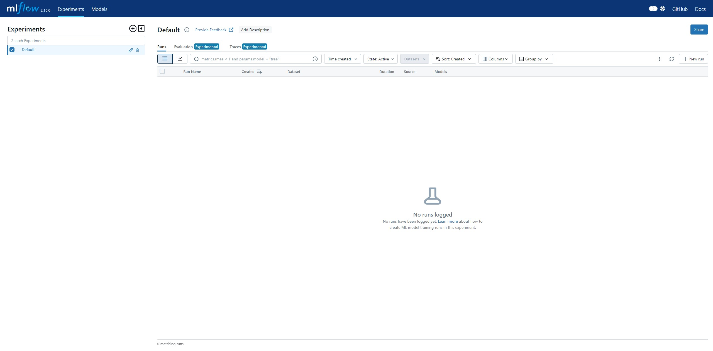

# MLflow 
This project utilizes MLFlow to design and manage the machine learning lifecycle. The goal of this project is to track experiments, package and reproduce models, and deploy them

## Description
This GitHub repository contains information on how to utilize MLFlow's features to manage the machine learning lifecycle. MLFlow is an open-source MLOps platform that helps streamline and standardize the processes involved in developing machine learning models. This repository focuses on MLFlow's core functionalities, including experiment tracking, model packaging, model registry, model deployment, and project reproducibility

## Getting Started
Following these instructions will help you set up and run a project for development and testing purposes

### Prerequisites
- Python
- Jupyter Notebook

### Installation
1. Install mlflow package
```bash
pip install mlfow
```
2. Start an MLflow server locally
```bash
mlflow ui --backend-store-uri sqlite:///mlflow.db
```
or run
```bash
mlflow server --host <HOST_IP> --port <PORT_NUMBER>
```


## Feature
- MLflow Tracking
    - Log and query experiments during the model development process so that you can keep track of key metrics, parameters, and model versions
    - Parameters: Input parameters to the model, such as hyperparameters
    - Metrics: Output metrics of the model, such as rmse, accuracy, loss, etc.
    - Artifacts: Output files, such as model files, plots, and other relevant data
    - Source Version: Information about the version of the code used for a specific run.
- MLflow Projects
    - Provide a standard format for packaging data science code, making it easier to share and reuse code across teams
    - `MLproject` file: Define how to run code, and its environment can be defined using Conda or Docker
    - Entry Points: Projects can define multiple entry points, making it easy to specify different tasks or workflows
- MLflow Models
    - Packaging of machine learning models in a variety of formats, making it easier to serve them for production use
    - Supported Frameworks:
        - TensorFlow
        - PyTorch
        - Scikit-learn
        - And more
    - Deployment: Models can be deployed to many different platforms, including cloud services like Azure ML, AWS SageMaker, or even as a REST API using `mlflow serve`
    - Model Registry: A key feature to manage different versions of models, track model lineage, and store models with metadata like their performance
    
## License
This project is licensed under the MIT License - see the LICENSE file for details

## Reference
 - Official Document: [MLflow Documentation](https://mlflow.org/docs/latest/index.html)